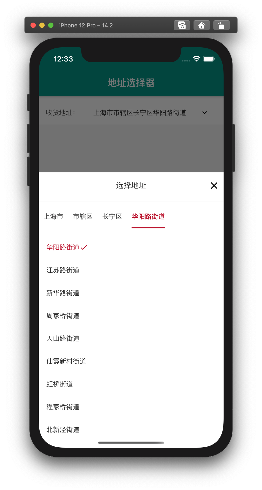

# xyz_city_picker

一个支持地图四级下钻的地址选择器


### 效果预览

{:height="50%" width="50%"}

### 如何使用

#### 添加xyz_city_picker
打开pubspec.yaml文件
添加如下代码
``` dart
  xyz_city_picker : ^1.0.0
```
添加后打开`Terminal`，执行 `flutter packages get`

#### 代码中引入
```dart
import 'package:xyz_city_picker/xyz_city_picker.dart';
```


#### 使用

**建议先clone下仓库，查看example目录的示例**

必须传入的参数有:

| 参数         | 含义       | 类型                                |
| ------------ | ---------- | ----------------------------------- |
| province     | 选择的省份 | Map                              |
| city         | 选择的城市 | Map                              |
| district     | 选择的区县 | Map                              |
| street       | 选择的街道 | Map                              |

代码使用如下：
```dart
GestureDetector(
  behavior: HitTestBehavior.translucent,
  onTap: () => XYZCityPicker.showPicker(
      province: province,
      city: city,
      district: district,
      street: street,
      context: context,
      onChange: (int index, Map checkedItem) {
        switch (index) {
          case 0:
           province = checkedItem;
            break;
          case 1:
          city = checkedItem;
            break;
          case 2:
          district = checkedItem;
            break;
          case 3:
          street = checkedItem;
            break;
        }
        setState(() {});
      }),
  child: Container()
)
```
在`onChanged`回调函数里面把选择的值带回，`onChanged`的函数签名如下：
```dart
typedef OnChange = Function(int index, Map checkedItem);
```
其中`index` 为`0`、`1`、`2`、`4`，分别标识`province`、`city`、`district`、`street` ，`checkedItem`则为选择的值.
